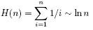

# Logarithms

* a logarithm is simply an inverse exponential function
* b^x=y => x=log(y) where the base of the logarithm is b
* exponential grows really fast, inverse exponential (log) grows slowly
* logarithms arise in any process where things are repeatedly halved

## Applications of logarithms

### binary search

* after each comparison half of the records can be discarded
* worst case log2(n) steps (base 2)

### binary tree height

* binary tree of height 1 => 2 leaf nodes
* binary tree of height 2 => 4 leaf nodes
* height h of a rooted binary tree with n leaf nodes: h = log2(n)
* trees with d children logd(n) (log base d)

### bits

* two bit patterns of length 1 (0,1)
* four bit patterns of length 2 (00, 01, 10, and 11)
* w bits representing n possibilities: 2^w=n ->  w=log2(n)

### multiplication

* loga(xy) = loga(x) + loga(y)
* loga(n^b) = b * loga(n)
* a^b using exp(x) = e^x and ln(x) = loge(x):
* a^b = exp(ln(a^b)) = exp(b ln a)

### fast exponentiation

* exactly compute a^n
* simplest: n-1 multiplications a * a ...
* n even a^n = (a^(n/2))^2
* n odd a^n = a(a^(n/2))^2
* we have halved the size of our exponent at the cost of two multiplications
* O(log n) multiplication will be enough

### summations

* Harmonic numbers: special case of arithmetic progression
* H(n) = S(n, -1)
* the sum of the progression of simple reciprocals

## Properties of logarithms

* important bases: log2 (lg), loge (ln), log10(log)
* loga(xy) = loga(x) + loga(y)
* loga(n^b) = b * loga(n)
* changing the base: loga(b) = logc(b) / logc(a)

### consequences

* **the base of the logarithm has no real impact on the growth rate**
* (since changing the base of the log from a to c involves dividing by logc(a) and that is lost to the Big Oh notation whenever a and c are constants)
* **logarithms cut any function down to size**
* the growth rate of the logarithm of ANY polynomial function is O(lg n)
* log(n!) = &Theta;(n log n)

