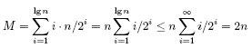

# Arrays and linked lists

* abstract data types: container (stack, queue), dictionary, priority queue
* common data structures than can be used to implement them: arrays or linked lists and so on
* **Contiguously-allocated structures** are composed of single slabs of memory
* **Linked data structures** are composed of distinct chunks of memory bound together by pointers

## Arrays

* fundamental contiguously-allocated data structure
* arrays are structures of fixed-size data records
* each element can be efficiently located by its index
* constant-time access given the index
* space efficient as no links/pointers
* memory locality: continuity between successive data accesses helps in exploiting CPU/memory caches
* cannot adjust their size in the middle of a program’s execution

### Dynamic arrays

When running out of allocated space:

* allocate bigger (e.g double) space
* and copy old contents

How many times might an element have to be recopied after a total of n insertions?

* starting from log2n doublings to get to n elements
* last half will only be copied once
* a quarter of the elements  will be copied twice
* all movements M will always be less than 2n

* each of the n elements move only two times on average

* total work of managing the dynamic array is the same O(n)
* no longer constant access all the time

## Pointers and Linked Structures

* pointers represent the address of a location in memory
* each node in our data structure contains one or more data fields that retain the data that we need to store
* each node contains a pointer field to at least one other node (e.g. next)
* (please note all these pointers require extra space)
* we also need a pointer to the head of the structure, so we know where to access it

### Linked lists

* simplest linked structure
* special linked list: **doubly-linked**, each node points both to its predecessor and its successor element (some operations are simpler at the cost of the extra pointer)
* searching:  if x is in the list, it is either the first element or located in the smaller rest of the list
* insertion: simplest, insert at the beginning and update the head of the list
* deletion: recurively find the precedessor and update its 'next' pointer (take care when head is deleted or the list doesn't contain the element)

## Comparison

The relative advantages of linked lists:

* overflow on linked structures only when memory is really full
* insertions and deletions are simpler than for contiguous (array) lists.
* with large records it's easier to move data then pointers

The relative advantages of arrays include:

* no extra space required for pointers
* efficient random access
* better memory locality and cache performance than random pointer jumping

